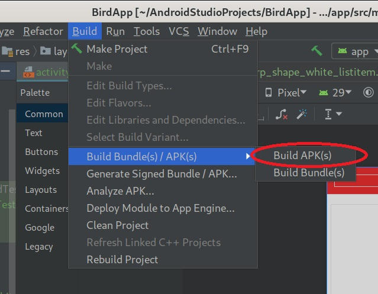
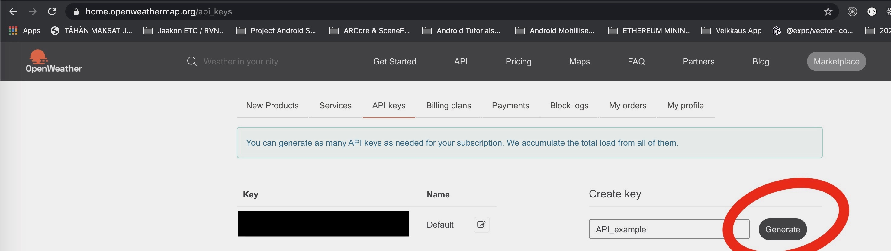

# ARTravel

## Tours and maps

ARTravel is a travel guide app for Android. It provides user information about user and weather location, nearby interesting places and a feature that allows user to make use of Camera's AR functionality. 
App is targeted for Android API versions 24 and above. 

### Features

<details><summary><b>Show features</b></summary>

1. Download or clone this GitHub repository.

2. Open the downloaded project in Android Studio (4.1.1 at the time of uploading)

* <b> Attractions </b>
Attractions fragment displays nearby places within 2 km radius. User can navigate to place detail screen and app provides user a route to selected place.

<p align="center">
  
</p>

* <b> Attraction Detail Screen </b>
View provides an image and a description of a place. Show on map displays a destination route to user selected place.

<p align="center">
  
</p>

* <b> Attraction Draw Route </b>
Route is drawn in Google Maps to user selected place.

<p align="center">
  
</p>

* <b> Maps Fragment </b>
Uses Google Maps to locate user with GPS and "LIST PLACES" menu gives user an option to mark a close place. 

<p align="center">
  
</p>

* <b> Weather Fragment </b>
Provides current weather information to user. Measurements can be changed from metric to imperial within Settings. 

<p align="center">
  
</p>

* <b> AR Take Image </b>
User can add one of the 4 preset 3D models (Pyramid, Colosseum, Great Wall of China and Taj Mahal) to the scene and take an image that is saved to Gallery.

<p align="center">
  
</p>

</details>

### Concepts used
<ul>
  <li>Fragments</li>
  <li>GPS</li>
  <li>Camera</li>
  <li>ARCore & Sceneform
  <li>LiveData, ViewModel</li>
  <li>Google Services, OpenTripMap API, OpenWeatherMap API</li>
</ul>

<b>Main packages that were used include: </b>
<ul>
  <li>Kotlinx Coroutines</li>
  <li>ReactiveX/RxJava</li>
  <li>retrofit2-kotlinx-serialization-converter</li>
  <li>com.github.jd-alexander:library:1.1.0</li>
  <li>com.google.android.gms:play-services-location:18.0.0</li>
  <li>Room Database packages</li>
  <li>ARCore</li>
</ul>

Phone’s internal sensor(s), which ones
Basic components (activity, broadcast receiver, service, content provider), which ones
Fragments
Persistence (Room and/or File and/or SharedPreferences), which one
Connection to some web service, which service
Have AR related functionality
External sensor(s) and BT-communication
NFC
GPS, microphone, camera, which ones
ViewModel, LiveData
WorkManager/Worker
Other APIs (map, audio, graph,...) or JetPack librairies


### Application screenshots

<details><summary><b>Show screenshots</b></summary>

<p align="center">
  
  
  
  
  
  
  
  
  
  
</p>

</details>

### Running, building, generating API keys.

<details><summary><b>Show instructions</b></summary>

1. Download or clone this GitHub repository.

2. Open the downloaded project in Android Studio (4.1.1 at the time of uploading) 

* <b> Running project. </b>
Running project will launch the application on an emulated or physical Android device.
In the image the current emulating device is set to Pixel 3 XL.
<p align="center">
  
</p>

* <b> Building project. </b>
Builds an APK of all modules in the current project for their selected variant. When IDE finishes building, a confirmation notification appears, providing a link to the APK file. The path to file is in <i><b>BirdApp/app/build/outputs/apk/debug/</b></i> and default file name is app-debug.
<p align="center">
  
</p>

* <b> Make project. </b>
Make project compile all the source files in the entire project that have been modified since the last compilation are compiled. 
Dependent source files, if appropriate, are also compiled.
<p align="center">
  
</p>

#### Generating API keys.

1. To use this project you must have an account on 3 different websites.
  <ul>
    <li>OpenTripMap</li>
    <li>Google Cloud</li>
    <li>Open Weather Map</li>
  </ul>
  
  ---
  
  * <b> Generating API for Google Services. </b>
After logging in to Google Cloud select APIs & Services > Credentials
<p align="center">
  
</p>

Select Create Credentials > API key.
<p align="center">
  
</p>

Newly created API key should appear and you can copy the API key to Android Studio.
<p align="center">
  
</p>

Before you can use the project you need to add 2 services: Directions and Places API. Select APIs & Services > Library.
<p align="center">
  
</p>

All enabled APIs & Services should appear in dashboard under APIs & Services > Dashboard.
<p align="center">
  
</p>

--- 

Register and login to OpenWeather. Make sure you have Current Weather service enabled in your user settings.
<p align="center">
  
</p>

Under API keys tab generate new API key.
<p align="center">
  
</p>

---

Register and login to OpentripMap API and you should have API key already generated.
<p align="center">
  
</p>


</details>

### Adding API keys in project

1. Create gradle.properties file in root of project.
2. Add three API keys inside of the double quotation marks.

<p align="center">
  
</p>

```
android.useAndroidX=true

android.enableJetifier=true

kotlin.code.style=official

GOOGLE_API_KEY="GOOGLE API KEY"
OPEN_TRIP_MAP_API_KEY="OPENTRIPMAP API KEY"
OPEN_WEATHER_API_KEY="OPENWEATHER API KEY"
```

You also need to add google_maps_api.xml file to values directory
<p align="center">
  
</p>

```
<resources>
    <!--
    TODO: Before you run your application, you need a Google Maps API key.

    To get one, follow this link, follow the directions and press "Create" at the end:

    https://console.developers.google.com/flows/enableapi?apiid=maps_android_backend&keyType=CLIENT_SIDE_ANDROID&r=52:27:87:89:EA:3C:59:91:09:F9:3D:31:5D:EC:D6:AD:22:4A:C8:21%3Bcom.example.artravel

    You can also add your credentials to an existing key, using these values:

    Package name:
    com.example.artravel

    SHA-1 certificate fingerprint:
    52:27:87:89:EA:3C:59:91:09:F9:3D:31:5D:EC:D6:AD:22:4A:C8:21

    Alternatively, follow the directions here:
    https://developers.google.com/maps/documentation/android/start#get-key

    Once you have your key (it starts with "AIza"), replace the "google_maps_key"
    string in this file.
    -->
    <string name="google_maps_key" templateMergeStrategy="preserve" translatable="false">GOOGLE API KEY</string>
</resources>
```
