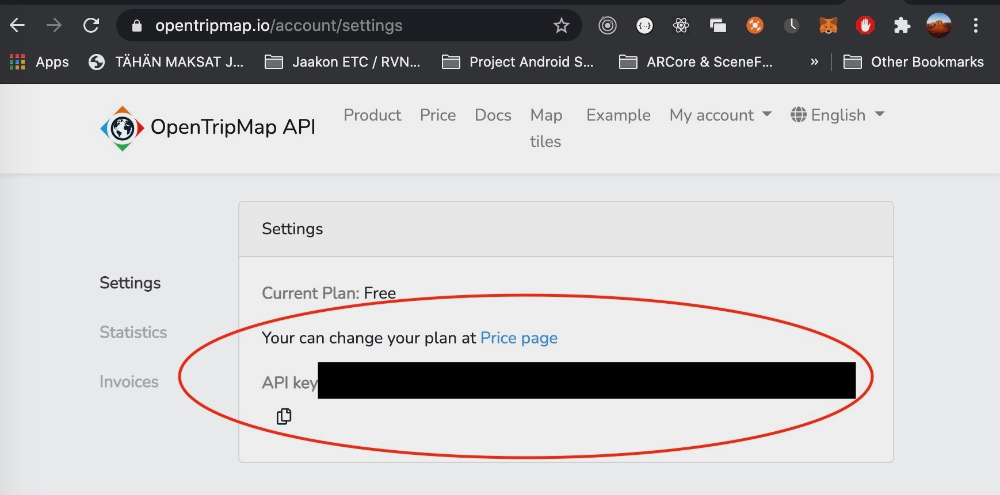

# ARTravel

## Tours and maps

The application aims to develop detailed texts, pictures,
videos and other guidance information are provided, and so
people can better understand the tourist attractions and
make decision objectively. A problem is shown that tourists
are not able to get travel information timely when they are
on the move. Therefore, we intend to explore how to build a
mobile tourist guide system based on mashup technology to
solve this problem. 


Have you ever wanted to visit the Louvre, hike Mount Everest, or wander through the pyramids of Giza,
but you just don’t have the time? If you can’t go there, AR can turn any hallway into a museum, 
any molehill into a mountain, and any park into a pyramid, that you’ll be able to see through your iPhone or Android device.

augmented reality mobile app development for all
If you are able to go to your favorite places, AR make any tour more interesting by giving more of the information that actually want. 
Some people want to know the history, some like to hear stories and others want to get to know the people behind the portraits. 
AR allows everyone to see more of what they want and make every experience unique.

You could even record your adventure and then send it to a friend to walk through it with you.

### Description

### Features

### Concepts used
<ul>
  <li>Fragments</li>
  <li>GPS</li>
  <li>Camera</li>
  <li>LiveData, ViewModel</li>
  <li>Google Services, OpenTripMap API, OpenWeatherMap API</li>
</ul>
Phone’s internal sensor(s), which ones
Basic components (activity, broadcast receiver, service, content provider), which ones
Fragments
Persistence (Room and/or File and/or SharedPreferences), which one
Connection to some web service, which service
Have AR related functionality
External sensor(s) and BT-communication
NFC
GPS, microphone, camera, which ones
ViewModel, LiveData
WorkManager/Worker
Other APIs (map, audio, graph,...) or JetPack librairies


### Application screenshots

<details><summary><b>Show screenshots</b></summary>

<p align="center">
  
  
  
  
  
  
  
  
  
  
</p>

</details>

### Running, building, generate API keys.

<details><summary><b>Show instructions</b></summary>

1. Download or clone this GitHub repository.

2. Open the downloaded project in Android Studio (4.1.1 at the time of uploading) 

* <b> Running project. </b>
Running project will launch the application on an emulated or physical Android device.
In the image the current emulating device is set to Pixel 3 XL.
<p align="center">
  
</p>

* <b> Building project. </b>
Builds an APK of all modules in the current project for their selected variant. When IDE finishes building, a confirmation notification appears, providing a link to the APK file. The path to file is in <i><b>BirdApp/app/build/outputs/apk/debug/</b></i> and default file name is app-debug.
<p align="center">
  
</p>

* <b> Make project. </b>
Make project compile all the source files in the entire project that have been modified since the last compilation are compiled. 
Dependent source files, if appropriate, are also compiled.
<p align="center">
  
</p>

#### Generating API keys.

1. To use this project you must have an account on 3 different websites.
  <ul>
    <li>OpenTripMap</li>
    <li>Google Cloud</li>
    <li>Open Weather Map</li>
  </ul>
  
  ---
  
  * <b> Generating API for Google Services . </b>
After logging in to Google Cloud select APIs & Services > Credentials
<p align="center">
  
</p>

Select Create Credentials > API key.
<p align="center">
  
</p>

Newly created API key should appear and you can copy the API key to Android Studio.
<p align="center">
  
</p>

Before you can use the project you need to add 2 services: Directions and Places API. Select APIs & Services > Library.
<p align="center">
  
</p>

All enabled APIs & Services should appear in dashboard under APIs & Services > Dashboard.
<p align="center">
  
</p>

--- 

Register and login to OpenWeather. Make sure you have Current Weather service enabled in your user settings.
<p align="center">
  
</p>

Under API keys tab generate new API key.
<p align="center">
  
</p>

---

Register and login to OpentripMap API and you should have API key already generated.
<p align="center">
  
</p>


</details>

### Adding API keys in project

1. Create gradle.properties file in root of project.
2. Add three API keys inside of the double quotation marks.

<p align="center">
  
</p>

```
android.useAndroidX=true

android.enableJetifier=true

kotlin.code.style=official

GOOGLE_API_KEY="GOOGLE API KEY"
OPEN_TRIP_MAP_API_KEY="OPENTRIPMAP API KEY"
OPEN_WEATHER_API_KEY="OPENWEATHER API KEY"
```

You also need to add google_maps_api.xml file to values directory
<p align="center">
  
</p>

```
<resources>
    <!--
    TODO: Before you run your application, you need a Google Maps API key.

    To get one, follow this link, follow the directions and press "Create" at the end:

    https://console.developers.google.com/flows/enableapi?apiid=maps_android_backend&keyType=CLIENT_SIDE_ANDROID&r=52:27:87:89:EA:3C:59:91:09:F9:3D:31:5D:EC:D6:AD:22:4A:C8:21%3Bcom.example.artravel

    You can also add your credentials to an existing key, using these values:

    Package name:
    com.example.artravel

    SHA-1 certificate fingerprint:
    52:27:87:89:EA:3C:59:91:09:F9:3D:31:5D:EC:D6:AD:22:4A:C8:21

    Alternatively, follow the directions here:
    https://developers.google.com/maps/documentation/android/start#get-key

    Once you have your key (it starts with "AIza"), replace the "google_maps_key"
    string in this file.
    -->
    <string name="google_maps_key" templateMergeStrategy="preserve" translatable="false">GOOGLE API KEY</string>
</resources>
```
