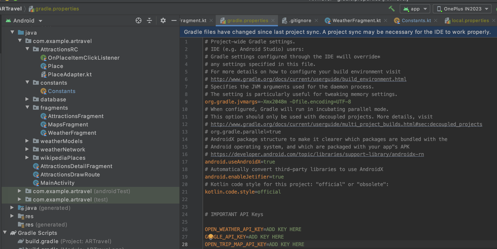

# ARTravel

## Tours and maps

The application aims to develop detailed texts, pictures,
videos and other guidance information are provided, and so
people can better understand the tourist attractions and
make decision objectively. A problem is shown that tourists
are not able to get travel information timely when they are
on the move. Therefore, we intend to explore how to build a
mobile tourist guide system based on mashup technology to
solve this problem. 


Have you ever wanted to visit the Louvre, hike Mount Everest, or wander through the pyramids of Giza,
but you just don’t have the time? If you can’t go there, AR can turn any hallway into a museum, 
any molehill into a mountain, and any park into a pyramid, that you’ll be able to see through your iPhone or Android device.

augmented reality mobile app development for all
If you are able to go to your favorite places, AR make any tour more interesting by giving more of the information that actually want. 
Some people want to know the history, some like to hear stories and others want to get to know the people behind the portraits. 
AR allows everyone to see more of what they want and make every experience unique.

You could even record your adventure and then send it to a friend to walk through it with you.


### Adding API KEYS to USE the APP

1. Create gradle.properties file in root of project.
2. Add three API keys accordingly

<p align="center">
  
</p>


You also need to add google_maps_api.xml file to values directory
<p align="center">
  
</p>

```
<resources>
    <!--
    TODO: Before you run your application, you need a Google Maps API key.

    To get one, follow this link, follow the directions and press "Create" at the end:

    https://console.developers.google.com/flows/enableapi?apiid=maps_android_backend&keyType=CLIENT_SIDE_ANDROID&r=52:27:87:89:EA:3C:59:91:09:F9:3D:31:5D:EC:D6:AD:22:4A:C8:21%3Bcom.example.artravel

    You can also add your credentials to an existing key, using these values:

    Package name:
    com.example.artravel

    SHA-1 certificate fingerprint:
    52:27:87:89:EA:3C:59:91:09:F9:3D:31:5D:EC:D6:AD:22:4A:C8:21

    Alternatively, follow the directions here:
    https://developers.google.com/maps/documentation/android/start#get-key

    Once you have your key (it starts with "AIza"), replace the "google_maps_key"
    string in this file.
    -->
    <string name="google_maps_key" templateMergeStrategy="preserve" translatable="false">GOOGLE API KEY</string>
</resources>
```
